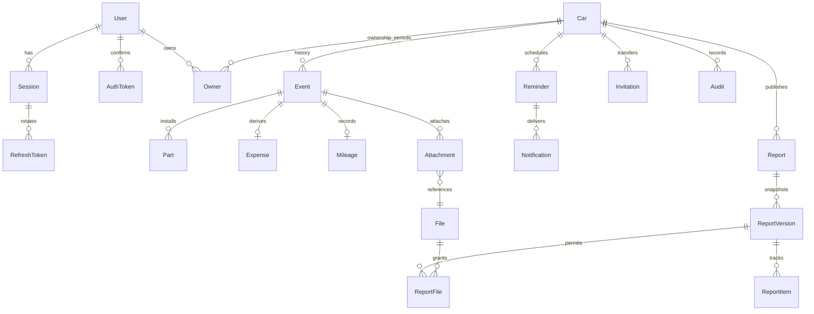

# Архитектура и схема данных

## Организация

- `apps/web`: app → pages → widgets → features → entities/shared. Server state — TanStack Query; Zustand хранит только выбранный ID автомобиля.
- `apps/api`: Nest-контроллеры, `HistoryService`, `AuthService`, `ReportsService`, `FilesService`, общий Prisma-клиент. Домены сгруппированы по связанным операциям в `modules/`; отдельный `worker.ts` обрабатывает BullMQ.
- `packages/validation`: строгие Zod-схемы; `packages/contracts`: клиентские DTO; `packages/config`: назначение общих настроек.

Схема сознательно использует единую таблицу `Event` вместо трёх почти одинаковых корней `service_records`, `accidents`, `documents`. Поля вариантов проходят Zod-валидацию, деньги, запчасти, пробег, владение и связи файлов остаются отдельными таблицами с FK. Это архитектурное отличие от предложенной в ТЗ схемы, а не mock-данные.

## Запись обслуживания

1. Транзакция блокирует строку автомобиля (`FOR UPDATE`) и повторно проверяет текущее владение.
2. Ключ идемпотентности уникален в рамках автомобиля; хеш тела исключает его использование для другой операции.
3. Проверяются ближайшие показания по дате, принадлежность СТО и каждого файла.
4. Decimal-расчёт создаёт/обновляет `Event`, `Part[]`, единственный `Expense` (только при положительной сумме), единственный `Mileage`, напоминание, `Audit` и `Outbox`.
5. При ошибке все изменения откатываются. HTTP-ответ строится явным DTO.

`Event.deletedAt` исключает связанные расходы и показания из агрегатов. История показывает только корневое событие, а не три дубликата. Изменения оптимистически защищены `version`. SQL дополнительно обеспечивает одного владельца, уникальность активного VIN и неотрицательные значения.

## Одометр

Последнее показание выбирается по дате, времени создания и ID. Замена одометра хранится в `Mileage.changeType`; расчёты ресурса деталей после разрыва возвращают неизвестное расстояние. Это минимальная модель сегментов: автоматического вычисления полного пробега машины через заменённые приборы нет, отдельной таблицы накопленных offsets тоже нет.

## Публикация

Allowlist-сериализатор строит отдельный JSON-снимок. Снимок не содержит пользователей, email, object keys и приватных файлов. `ReportItem` хранит версию источника и флаги последующего изменения/удаления. Новая публикация добавляет версию, сохраняя безопасные отметки; старые снимки не перезаписываются. Вложения разрешены точным `ReportFile`, URL действителен 300 секунд. Отзыв блокирует новый доступ, уже выданный URL истекает самостоятельно.

## Владение

Текущее владение — `Owner.endedAt IS NULL`, защищено partial unique index. Принятие приглашения блокирует машину, проверяет подтверждённый email получателя, закрывает старое владение и создаёт новое. Повтор принятия не создаёт дубль. Ссылки прежнего владельца отзываются. Документы и файлы без `transferAllowed` не видны получателю; аудит прежнего автора ему тоже не отдаётся.

## Сессии и файлы

- Argon2id: 19 MiB, 2 итерации, parallelism 1; параметры централизованы в auth-модуле.
- JWT: 15 минут, issuer/audience, session ID, обязательная проверка отзыва на каждом запросе.
- Refresh: 256 случайных бит, хеш в БД, 30 дней, HttpOnly cookie, атомарная ротация, отзыв семейства при повторе.
- Cookie-зависимые и остальные изменения требуют точный Origin и `X-CSRF: 1`; CORS допускает только frontend origin.
- Загрузка проверяет сигнатуру, размер, квоту и владение. SVG/HTML не принимаются. При production обязательна доступность ClamAV; непроверенный файл не становится ready.
- В логах нет URL-токенов, cookie, тел запросов и подписанных URL; есть request ID, шаблон маршрута, статус и длительность.

## Доставка

Outbox создаётся вместе с данными в PostgreSQL. Worker переносит задания в BullMQ, повторяет с backoff, периодически проверяет даты и очищает незавершённые загрузки. `Notification.deliveryKey` предотвращает дубль уведомления после перезапуска. SMTP имеет at-least-once семантику: при аварии между отправкой письма и фиксацией sentAt возможно повторное письмо; стабильный Message-ID облегчает дедупликацию провайдера. Текст со ссылкой после успешной отправки удаляется из outbox.
